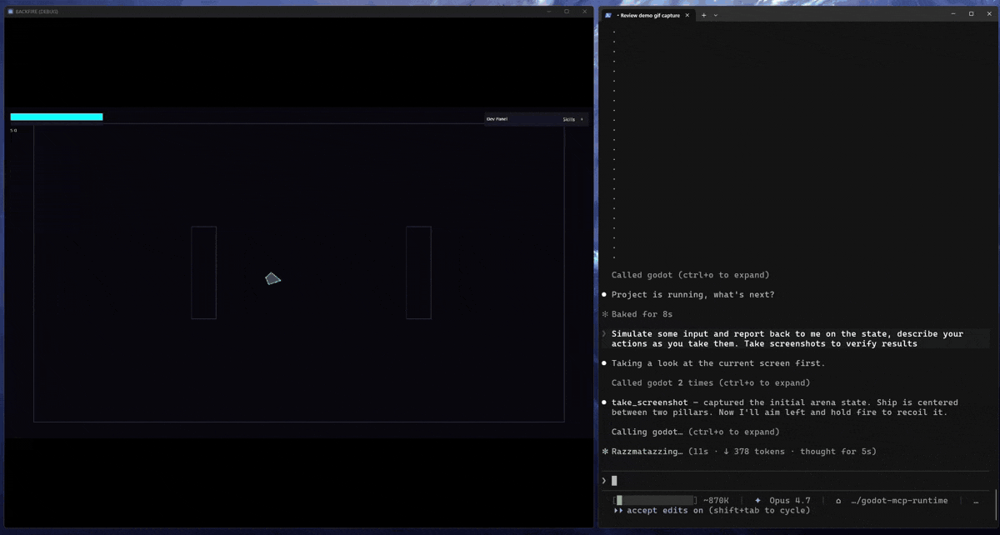

# Godot MCP Runtime

<p align="center">
  <a href="https://glama.ai/mcp/servers/@Erodenn/godot-mcp-runtime"></a>
</p>

<p align="center">
  <a href="https://modelcontextprotocol.io/introduction"></a>
  <a href="https://www.npmjs.com/package/godot-mcp-runtime"></a>
  <a href="https://www.npmjs.com/package/godot-mcp-runtime"></a>
  <a href="LICENSE"></a>
  <a href="https://nodejs.org/"></a>
</p>

A lightweight [MCP](https://modelcontextprotocol.io/) server that pairs comprehensive headless editing with full runtime control over a [Godot](https://godotengine.org/) 4.x project. Scene, node, autoload, and validation ops cover everything short of the most niche corners of the engine; the runtime bridge adds screenshots, input simulation, UI discovery, and live GDScript against the running scene tree.

<p align="center"></p>

<h3 align="center">The AI doesn't just write your game, it can check its work.</h3>
<br>

- **Headless editing** — scenes, nodes, scripts, signals, validation, no editor window
- **Runtime control** — screenshots, input simulation, UI discovery, and live GDScript against the running game
- **Zero footprint** — no Godot addon, no project commits, auto-cleanup on shutdown

**No addon required.** Most Godot MCP servers that offer runtime support ship as a Godot addon, something you install into your project, commit to version control, and manage as a dependency. Use npx and there's no install or setup needed.

Think of it as [Playwright MCP](https://github.com/microsoft/playwright-mcp), but for Godot. This does the same thing for games: run the project, take a screenshot, simulate input, read what's on screen, execute a script against the live scene tree. The agent closes the loop on its own changes rather than handing off to you to verify.

> [!NOTE]
> This is not a playtesting replacement. It doesn't catch the subtle feel issues that only a human notices, and it won't tell you if your game is fun. What it does is let an agent confirm that a scene loads, a button responds, a value updated, a script ran without errors. The ability to check work is crucial for AI driven workflows.

## Contents

- [What It Does](#what-it-does)
- [Quick Start](#quick-start)
- [Docs](#docs)
- [Acknowledgments](#acknowledgments)
- [License](#license)

## What It Does

**Built for agents.** Every tool is purpose-built and self-documenting. When something fails, the response tells the agent how to fix it; when something succeeds, it points toward the next step. The result is an AI that stays unstuck and self-corrects without needing you to nudge it along.

**Headless editing.** Create scenes, add nodes, set properties, attach scripts, connect signals, validate GDScript. All the standard operations, no editor window required.

**Runtime bridge.** When `run_project` or `attach_project` is called, the server injects `McpBridge` as an autoload. This opens a localhost-only TCP listener (both auto-select a free port when `bridgePort` is omitted; pass `bridgePort` to pin a specific port) and enables:

- **Screenshots:** Capture the viewport — by default returns a 960x540 preview inline plus the full PNG on disk; use `responseMode: 'full'` for pixel-perfect or `'path_only'` to skip the inline image
- **Input simulation:** Batched sequences of key presses, mouse clicks, mouse motion, UI element clicks by name or path, Godot action events, and timed waits
- **UI discovery:** Walk the live scene tree and collect every visible Control node with its position, type, text content, and disabled state
- **Live script execution:** Compile and run arbitrary GDScript with full SceneTree access while the game is running

**Background mode.** Pass `background: true` to `run_project` and the Godot window moves off-screen (positioned at `(-9999, -9999)`) with physical input blocked: borderless, unfocusable, mouse-passthrough. Programmatic input, screenshots, and all runtime tools work exactly the same. Useful for automated agent-driven testing where the window shouldn't be visible or interactive.

**Manual attach mode.** When something other than MCP launches the game (a CI pipeline, an external debugger, your own shell), call `attach_project` first. It injects the bridge and marks the project active without spawning Godot, so when you launch the game manually, runtime tools work against it. Use `detach_project` when done.

> [!IMPORTANT]
> `get_debug_output` is unavailable in attached mode. stdout and stderr only flow through processes MCP started itself, so when Godot is launched externally there's no captured output to return. Use `run_project` if you need the debug stream.

The bridge cleans itself up automatically when `stop_project` or `detach_project` is called. No leftover autoloads, no modified project files.

## Quick Start

### Prerequisites

- [Node.js](https://nodejs.org/) v20+
- [Godot 4.x](https://godotengine.org/)

That's it. No Godot addon, no project modifications.

### Configure Your MCP Client

Add the following to your MCP client config. Works with Claude Code, Claude Desktop, Cursor, or any MCP-compatible client.

**Zero-install via npx (recommended):**

```json
{
  "mcpServers": {
    "godot": {
      "command": "npx",
      "args": ["-y", "godot-mcp-runtime"],
      "env": {
        "GODOT_PATH": "<path-to-godot-executable>"
      }
    }
  }
}
```

**Or install globally:**

```bash
npm install -g godot-mcp-runtime
```

```json
{
  "mcpServers": {
    "godot": {
      "command": "godot-mcp-runtime",
      "env": {
        "GODOT_PATH": "<path-to-godot-executable>"
      }
    }
  }
}
```

**Or clone from source:**

```bash
git clone https://github.com/Erodenn/godot-mcp-runtime.git
cd godot-mcp-runtime
npm install
npm run build
```

```json
{
  "mcpServers": {
    "godot": {
      "command": "node",
      "args": ["<path-to>/godot-mcp-runtime/dist/index.js"],
      "env": {
        "GODOT_PATH": "<path-to-godot-executable>"
      }
    }
  }
}
```

> [!TIP]
> **Prefer pnpm?** All three install paths work with pnpm. Substitute `pnpm dlx godot-mcp-runtime` for `npx -y godot-mcp-runtime`, `pnpm add -g godot-mcp-runtime` for the global install, or `pnpm install && pnpm run build` for the source build. pnpm ships stronger defaults against npm supply-chain attacks; see [pnpm's supply chain security guide](https://pnpm.io/supply-chain-security).

If Godot is on your `PATH`, you can omit `GODOT_PATH` entirely. The server will auto-detect it. Set `"DEBUG": "true"` in `env` for verbose logging.

### Verify

Ask your AI assistant to call `get_project_info`. If it returns a Godot version string (e.g., `4.4.stable`), you're connected and working.

## Docs

- [`docs/tools.md`](docs/tools.md) — full tool reference, grouped by category
- [`docs/tool-authoring.md`](docs/tool-authoring.md) — standards for adding or modifying tools
- [`docs/architecture.md`](docs/architecture.md) — source layout, bridge sequence diagram, lifecycle steps, runtime artifact behavior

## Acknowledgments

Built on the foundation laid by [Coding-Solo/godot-mcp](https://github.com/Coding-Solo/godot-mcp) for headless Godot operations.

Developed with [Claude Code](https://claude.ai/code).

## License

[MIT](LICENSE)
