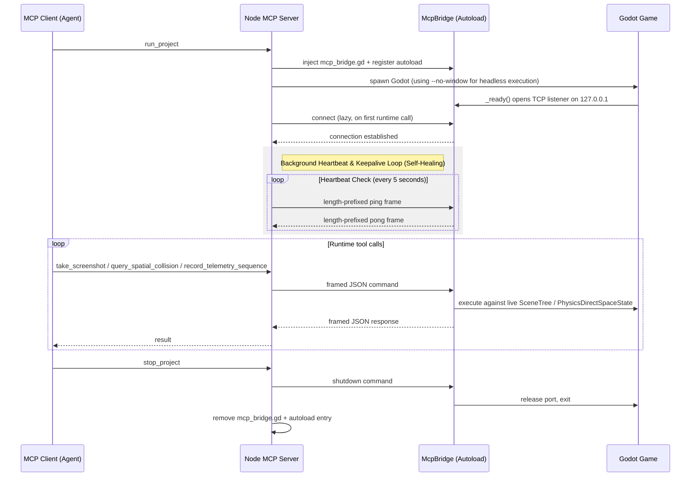

# Architecture

The internal design of the `godot-mcp-runtime` server is built on a hybrid architecture that decouples offline file serialization from live runtime execution. 

```
src/
├── index.ts                # MCP server entry point, server setup
├── dispatch.ts             # Tool-name -> handler dispatch table
├── tools/
│   ├── project-tools.ts    # Project introspection (list_projects, get_project_info, files, search, settings, scene_dependencies)
│   ├── runtime-tools.ts    # Runtime/lifecycle (run_project, attach_project, take_screenshot, query_spatial_collision, etc.)
│   ├── autoload-tools.ts   # Autoload management (list/add/remove/update_autoload)
│   ├── scene-tools.ts      # Scene creation, node addition, sprite loading, batch ops
│   ├── node-tools.ts       # Node properties, scripts, tree, duplication, signals, layout
│   ├── validate-tools.ts   # GDScript and scene validation
│   ├── script-tools.ts     # GDScript method/variable parsing and AST-based injection
│   ├── input-tools.ts      # Input map controls inside project.godot
│   ├── resource-tools.ts   # Material compilation and offline TRES serialization
│   ├── shader-tools.ts     # Shader creation and application
│   ├── tilemap-tools.ts    # 2D TileMap and 3D GridMap placement libraries
│   ├── animation-tools.ts  # Animation track editing and transition piping
│   └── import-resource-tools.js # Headless asset re-import pipelines
├── scripts/
│   ├── godot_operations.gd # Headless GDScript operations (Expression parser)
│   └── mcp_bridge.gd       # TCP autoload for runtime communication (heartbeats)
└── utils/
    ├── godot-runner.ts     # Process spawning, output parsing, shared validation helpers
    ├── handler-helpers.ts  # executeSceneOp wrapper for headless-op handlers
    ├── bridge-manager.ts   # McpBridge artifact lifecycle (inject, cleanup, repair)
    ├── bridge-protocol.ts  # TCP framing (length-prefixed frames, port resolution)
    ├── autoload-ini.ts     # project.godot [autoload] INI primitives
    ├── snapshot-manager.ts # Offline file backups for transactional rollback safety
    └── logger.ts           # logDebug / logError helpers
```

---

## Communication and Runtime Control

Runtime operations communicate over a long-lived TCP connection with the injected `McpBridge` autoload. The bridge uses length-prefixed big-endian framing (a 4-byte big-endian integer specifying the length of the trailing payload, followed by the UTF-8 encoded JSON frame).



### Self-Healing & Connection Resilience
To prevent dead or hung connections (which occur if the display server suspends or the engine pauses for disk imports), `bridge-protocol.ts` implements a self-healing background supervisor:
1. **Heartbeat Pings** - Every 5 seconds, the Node layer sends an empty ping frame. The bridge must reply with a pong frame within 1.5 seconds.
2. **Keepalives** - Standard OS-level TCP keepalives are enabled on the socket to detect sudden hardware drops.
3. **Auto-Recovery** - If a heartbeat times out or the socket drops, the Node layer enters a reconnect state. It attempts to scan port offsets `(bridgePort + 1)` up to `(bridgePort + 5)` in case the engine rebooted onto an adjacent port, automatically restoring connection mapping without failing the active task.

---

## Core Subsystems

### 1. Type-Safe Auto-Coercion Layer
When an agent mutates property values via tools like `set_node_properties`, sending raw JSON parameters can easily lead to engine type mismatches (which cause silent crashes or debugger faults in Godot). The runtime implements a type-safe auto-coercion boundary in `mcp_bridge.gd` and `godot_operations.gd` using Godot's built-in `Expression` compiling structures:
* **Detection** - When property values are supplied as strings matching common type patterns (such as starting with `"Vector2("`, `"Vector3("`, `"Color("`, or starting with `#` for hex colors), the coercion layer intercepts the string.
* **Compilation** - An `Expression` instance is compiled natively at runtime:
  ```gdscript
  var expr = Expression.new()
  var err = expr.parse(value_str)
  if err == OK:
      var typed_val = expr.execute([], null, true)
      # Value is now a native, typed Vector2, Vector3, or Color object
  ```
* **Offline Fallback** - For offline serialization, the Node parser maps these string structures directly into canonical INI-like configurations in `.tscn` and `.tres` files.

### 2. Offline Snapshot Transaction-Backup Pipeline
Headless file modification tools (e.g. `add_node`, `setup_control`, `pipe_animation_states`) work directly on files on disk without launching the Godot editor GUI. In a standard editor session, modifications are recorded in the `EditorUndoRedoManager`. However, in headless environments, accessing the editor's undo buffer throws a fatal crash because editor singletons are not loaded.

To preserve complete undo safety and protect against file corruption, we implement an offline transactional snapshot system in the Node layer (`snapshot-manager.ts`):
* **Baking Snapshots** - Before any scene or resource mutation, a binary-safe copy of the target file is saved to `.mcp/backups/<filename>.<timestamp>.bak`.
* **Atomic Validation** - Once the headless subprocess completes, the modified file is validated via the `validate` tool.
* **Rollbacks** - If validation fails or the subprocess throws a syntax error, the Node layer instantly rolls back the change by replacing the file with the backup copy, ensuring zero corrupted scenes.
* **Cleanup** - Backups are automatically pruned after 24 hours to keep the `.mcp/` footprint small.

### 3. Dynamic Telemetry & Sequence Recording
Analyzing spatial movements (such as vehicle velocity or pedestrian steering) is difficult to verify using single-frame screenshots. The runtime exposes `record_telemetry_sequence` to record temporal sequences:
* **Buffer Logging** - When triggered, the bridge starts recording up to 60 frames of physical and spatial telemetry (e.g., node position, linear velocity, angular momentum, and raycast hits) at regular physics intervals.
* **Visual Coupling** - If requested, the bridge saves low-resolution diagnostic screenshots corresponding to each telemetry frame.
* **Disk Storage** - To prevent bloating the agent's context window with large base64 data payloads, the images and raw CSV/JSON logs are saved to `.mcp/telemetry/<sequence_id>/` on disk. The tool returns a structured JSON summary (min/max bounds, travel distance, and collision points), allowing the agent to verify physical behaviors without context overload.

---

## Runtime Artifacts

Files generated during runtime (screenshots, executed scripts, telemetry logs) are stored in `.mcp/` inside the project directory. This directory is automatically added to `.gitignore` and contains a `.gdignore` file to prevent Godot from attempting to import these temporary resources.
